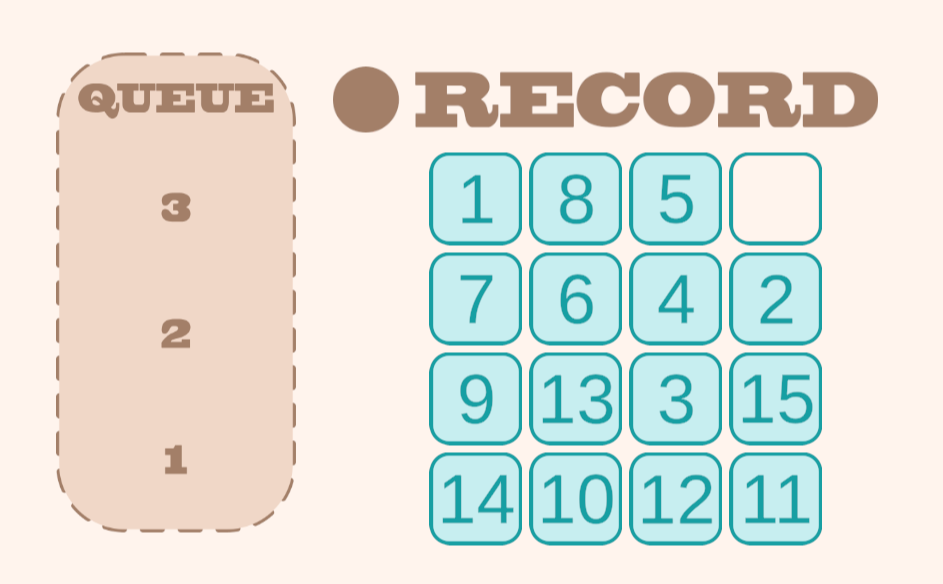
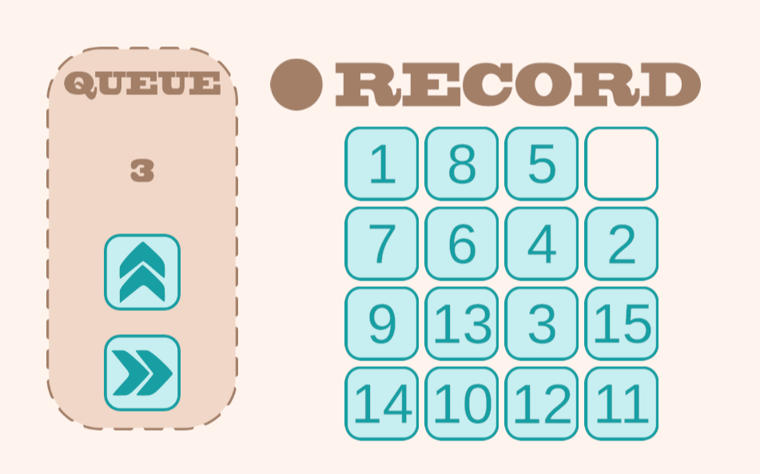

# Tile Slide Puzzle

Your goal is it to slide all the tiles to their correct position.
The tricky part is, that you need to plan three of your moves in advance, because they are stored in a queue before they are executed.

## 1st Record Your Moves

## 2nd Replay Your Moves

## Goal
|  1 |  2 |  3 |  4 |
|:--:|:--:|:--:|:--:|
|  5 |  6 |  7 |  8 |
|  9 | 10 | 11 | 12 |
| 13 | 14 | 15 |    |